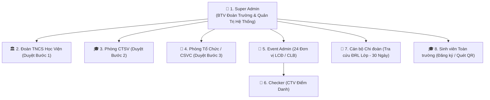
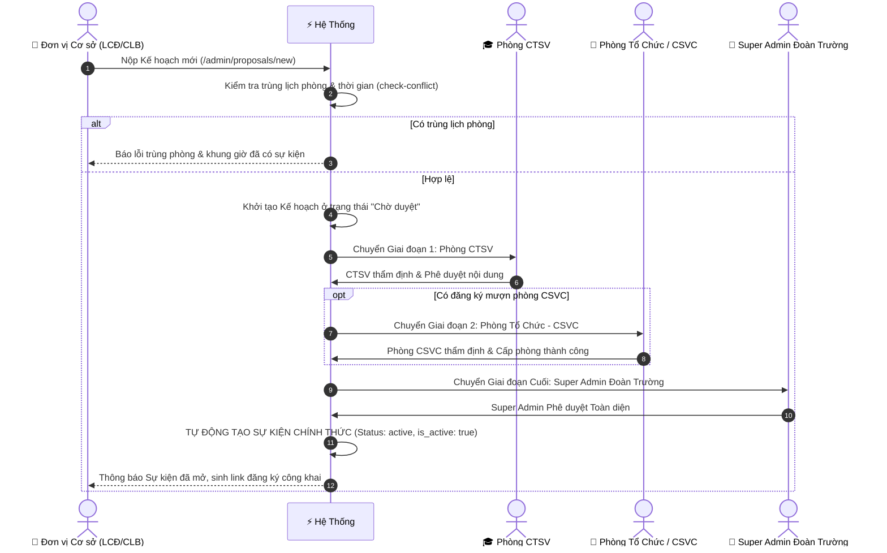
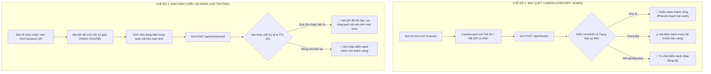
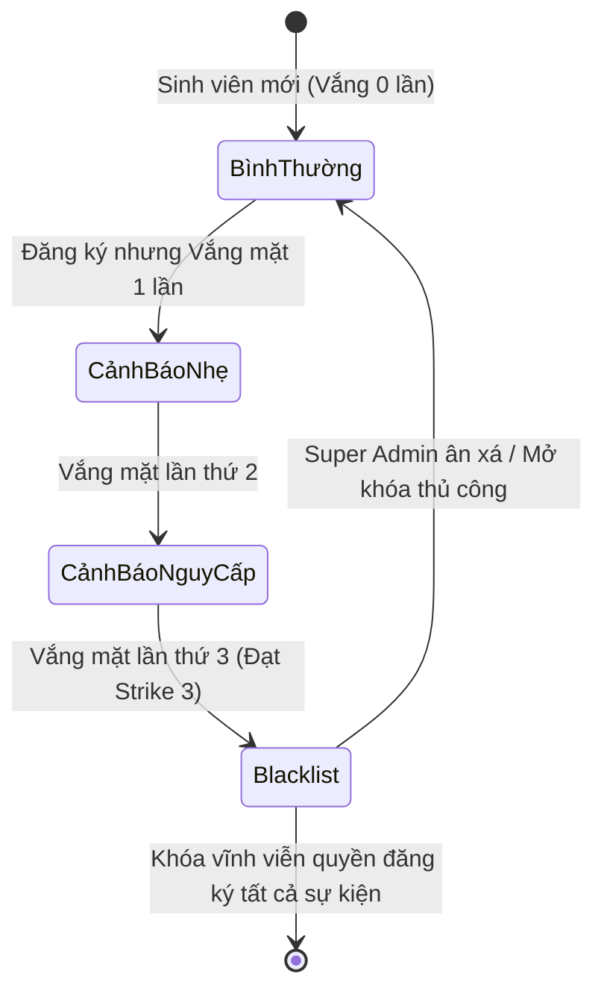

# 📘 TÀI LIỆU NGHIỆP VỤ HỆ THỐNG QUẢN LÝ HOẠT ĐỘNG ĐOÀN PTIT HCM
> **ĐOÀN HỌC VIỆN CÔNG NGHỆ BƯU CHÍNH VIỄN THÔNG — CƠ SỞ TẠI TP. HỒ CHÍ MINH**  
> *Hệ thống Quản trị Sự kiện, Điểm danh QR Động, Duyệt Kế hoạch Đa cấp, Tra cứu Điểm Rèn Luyện & Chống Gian lận Toàn diện*  
> **Phiên bản:** 2.0.0 (Production Ready) • **Cập nhật:** Năm 2026

---

## 📑 MỤC LỤC

1. [TỔNG QUAN HỆ THỐNG & MỤC TIÊU SỐ HÓA](#1-tổng-quan-hệ-thống--mục-tiêu-số-hóa)
2. [CƠ CẤU TỔ CHỨC & MA TRẬN PHÂN QUYỀN (RBAC)](#2-cơ-cấu-tổ-chức--ma-trận-phân-quyền-rbac)
   - [2.1. Danh mục 24 Đơn vị Cơ sở Đoàn](#21-danh-mục-24-đơn-vị-cơ-sở-đoàn)
   - [2.2. Ma trận Phân quyền 7 Cấp](#22-ma-trận-phân-quyền-7-cấp)
3. [QUY TRÌNH NGHIỆP VỤ CHI TIẾT](#3-quy-trình-nghiệp-vụ-chi-tiết)
   - [Quy trình 1: Trình duyệt Kế hoạch Sự kiện & Cấp phòng (Proposals Workflow)](#quy-trình-1-trình-duyệt-kế-hoạch-sự-kiện--cấp-phòng-proposals-workflow)
   - [Quy trình 2: Cổng Đăng ký Công khai & Khóa Hạn chót 12 Giờ](#quy-trình-2-cổng-đăng-ký-công-khai--khóa-hạn-chót-12-giờ)
   - [Quy trình 3: Điểm danh QR Động Chống Gian lận (Dual-Mode Check-in)](#quy-trình-3-điểm-danh-qr-động-chống-gian-lận-dual-mode-check-in)
   - [Quy trình 4: Tự động Đóng Sự kiện Sau 1 Giờ (Auto-Close Engine)](#quy-trình-4-tự-động-đóng-sự-kiện-sau-1-giờ-auto-close-engine)
   - [Quy trình 5: Đối soát & Xử phạt Vắng mặt (3-Strike Blacklist Engine)](#quy-trình-5-đối-soát--xử-phạt-vắng-mặt-3-strike-blacklist-engine)
   - [Quy trình 6: Ủy quyền Cán bộ Chi đoàn Tra cứu ĐRL (30-Day Expiry)](#quy-trình-6-ủy-quyền-cán-bộ-chi-đoàn-tra-cứu-đrl-30-day-expiry)
   - [Quy trình 7: Đánh giá Sự kiện & Xuất Báo cáo Excel Chuẩn](#quy-trình-7-đánh-giá-sự-kiện--xuất-báo-cáo-excel-chuẩn)
4. [BẢN ĐỒ CƠ SỞ DỮ LIỆU (DATABASE SCHEMA DICTIONARY)](#4-bản-đồ-cơ-sở-dữ-liệu-database-schema-dictionary)
5. [DANH MỤC API ENDPOINTS & MÃ LỖI CHUẨN](#5-danh-mục-api-endpoints--mã-lỗi-chuẩn)
6. [TIÊU CHUẨN BẢO MẬT & HIỆU NĂNG](#6-tiêu-chuẩn-bảo-mật--hiệu-năng)

---

# 1. TỔNG QUAN HỆ THỐNG & MỤC TIÊU SỐ HÓA

### 🎯 Bối Cảnh & Mục Tiêu
Hệ thống **Quản Lý Hoạt Động Đoàn PTIT HCM** được xây dựng nhằm phục vụ công tác chuyển đổi số toàn diện cho phong trào sinh viên của **Đoàn Học viện Công nghệ Bưu chính Viễn thông - Cơ sở tại TP. Hồ Chí Minh**.

Hệ thống giải quyết triệt để 5 bài toán nghiệp vụ lớn:
1. **Chấm Dứt Gian Lận Điểm Danh:** Loại bỏ hoàn toàn tình trạng chụp ảnh mã QR truyền cho nhau hoặc điểm danh hộ thông qua công nghệ **Mã QR Động OTP đổi mỗi 10 giây (HMAC-SHA256)**.
2. **Số Hóa Quy Trình Trình Duyệt Kế Hoạch:** Chuyển đổi hồ sơ giấy sang luồng duyệt đa phòng ban điện tử (Ban Chấp hành Đoàn $\rightarrow$ Phòng CTSV $\rightarrow$ Phòng Tổ chức Hành chính/CSVC $\rightarrow$ Super Admin).
3. **Tự Động Hóa Chế Tài & Kỷ Luật Sinh Viên:** Hệ thống đối soát tự động xử lý hiện tượng "đăng ký ảo - bỏ tham gia" bằng **Cơ chế 3-Strike Blacklist**.
4. **Minh Bạch Hóa Điểm Rèn Luyện (ĐRL):** Cung cấp cổng tra cứu lịch sử tham gia có mã minh chứng xác thực cho sinh viên và trao quyền tra cứu lớp có thời hạn (30 ngày) cho Cán bộ Chi đoàn.
5. **Đồng Bộ Hóa Dữ Liệu 8,300+ Sinh Viên:** Tích hợp bộ lọc 24 đơn vị cơ sở và xuất báo cáo Excel chuẩn hóa tiếng Việt UTF-8.

---

# 2. CƠ CẤU TỔ CHỨC & MA TRẬN PHÂN QUYỀN (RBAC)

## 2.1. Danh mục 24 Đơn vị Cơ sở Đoàn
Hệ thống thiết lập danh sách cứng gồm **24 tổ chức thanh niên trực thuộc** PTIT HCM với email chính thức:

| STT | Mã Đơn Vị | Tên Đơn Vị Cơ Sở | Loại Hình | Email Quản Trị Hệ Thống |
| :---: | :--- | :--- | :--- | :--- |
| **1** | `LCD_CNTT` | Liên Chi Đoàn Khoa Công nghệ Thông tin | LCĐ Khoa | `lcdcntt@student.ptithcm.edu.vn` |
| **2** | `LCD_CNDPT` | Liên Chi Đoàn Công nghệ Đa phương tiện | LCĐ Khoa | `lcdcndpt@student.ptithcm.edu.vn` |
| **3** | `LCD_ATTT` | Liên Chi Đoàn An toàn Thông tin | LCĐ Khoa | `lcdattt@student.ptithcm.edu.vn` |
| **4** | `LCD_VT` | Liên Chi Đoàn Viễn thông | LCĐ Khoa | `lcdvt@student.ptithcm.edu.vn` |
| **5** | `LCD_DT` | Liên Chi Đoàn Điện tử | LCĐ Khoa | `lcddt@student.ptithcm.edu.vn` |
| **6** | `LCD_QTKD` | Liên Chi Đoàn Quản trị Kinh doanh | LCĐ Khoa | `lcdqtkd@student.ptithcm.edu.vn` |
| **7** | `LCD_MKT` | Liên Chi Đoàn Marketing | LCĐ Khoa | `lcdmkt@student.ptithcm.edu.vn` |
| **8** | `LCD_KETOAN` | Liên Chi Đoàn Kế toán | LCĐ Khoa | `lcdketoan@student.ptithcm.edu.vn` |
| **9** | `CLB_ITMC` | CLB Học thuật ITMC | CLB/Đội/Nhóm | `clb.itmc@student.ptithcm.edu.vn` |
| **10** | `CLB_ATTT_CLUB` | CLB An toàn Thông tin (SEC) | CLB/Đội/Nhóm | `clb.attt@student.ptithcm.edu.vn` |
| **11** | `CLB_TIENGANH` | CLB Tiếng Anh (PEC) | CLB/Đội/Nhóm | `clb.tienganh@student.ptithcm.edu.vn` |
| **12** | `DOI_VANNGHE` | Đội Văn Nghệ Xung Kích | CLB/Đội/Nhóm | `doi.vannghe@student.ptithcm.edu.vn` |
| **13** | `CLB_GUITAR` | CLB Guitar | CLB/Đội/Nhóm | `clb.guitar@student.ptithcm.edu.vn` |
| **14** | `DOI_TINHNGUYEN` | Đội Công Tác Xã Hội - Tình Nguyện | CLB/Đội/Nhóm | `doi.ctxh@student.ptithcm.edu.vn` |
| **15** | `CLB_KETNOI` | CLB Kỹ Năng & Kết Nối | CLB/Đội/Nhóm | `clb.ketnoi@student.ptithcm.edu.vn` |
| **16** | `CLB_CMC` | CLB Truyền Thông Đa Phương Tiện (CMC) | CLB/Đội/Nhóm | `clb.cmc@student.ptithcm.edu.vn` |
| **17** | `CLB_37DO` | CLB Nhiếp Ảnh 37 Độ C | CLB/Đội/Nhóm | `clb.37do@student.ptithcm.edu.vn` |
| **18** | `CLB_BMA` | CLB Nhà Quản Trị Tương Lai (BMA) | CLB/Đội/Nhóm | `clb.bma@student.ptithcm.edu.vn` |
| **19** | `CLB_BONGCHUYEN` | CLB Bóng Chuyền | CLB/Đội/Nhóm | `clb.bongchuyen@student.ptithcm.edu.vn` |
| **20** | `CLB_BONGDA` | CLB Bóng Đá | CLB/Đội/Nhóm | `clb.bongda@student.ptithcm.edu.vn` |
| **21** | `CLB_BONGRO` | CLB Bóng Rổ | CLB/Đội/Nhóm | `clb.bongro@student.ptithcm.edu.vn` |
| **22** | `CLB_VOVINAM` | CLB Võ Thuật Vovinam | CLB/Đội/Nhóm | `clb.vovinam@student.ptithcm.edu.vn` |
| **23** | `CLB_CO` | CLB Cờ Vua - Cờ Tướng | CLB/Đội/Nhóm | `clb.co@student.ptithcm.edu.vn` |
| **24** | `CLB_CAULONG` | CLB Cầu Lông | CLB/Đội/Nhóm | `clb.caulong@student.ptithcm.edu.vn` |

---

## 2.2. Ma trận Phân quyền 7 Cấp & Đa Tài Khoản (Multi-Account RBAC)

Hệ thống hỗ trợ **Phân quyền đa tài khoản linh hoạt**: Super Admin có thể gán bất kỳ Email Google cá nhân nào của Học viện (`@ptithcm.edu.vn` hoặc `@student.ptithcm.edu.vn`) vào các ban ngành (Đoàn Học Viện, CTSV, CSVC, LCĐ/CLB, Super Admin) để các cán bộ làm việc độc lập mà không cần chia sẻ chung mật khẩu.



| Quyền hạn & Chức năng | Super Admin | Đoàn Học Viện | Phòng CTSV | Phòng CSVC | Event Admin (24 Đơn vị) | Checker (CTV) | Cán bộ Chi đoàn | Sinh viên |
| :--- | :---: | :---: | :---: | :---: | :---: | :---: | :---: | :---: |
| **Quản trị toàn trường (`/super-admin`)** | ✅ | ❌ | ❌ | ❌ | ❌ | ❌ | ❌ | ❌ |
| **Phân quyền Cán bộ đa tài khoản (`/api/admin/officers`)** | ✅ | ❌ | ❌ | ❌ | ❌ | ❌ | ❌ | ❌ |
| **Xem Nhật ký Kiểm toán nội bộ (Audit Trail chi tiết)** | ✅ | ❌ | ❌ | ❌ | ❌ | ❌ | ❌ | ❌ |
| **Tạo / Sửa / Xóa Sự kiện** | ✅ | ❌ | ❌ | ❌ | ✅ *(Sự kiện mình)* | ❌ | ❌ | ❌ |
| **Gán Admin / Phân quyền CTV sự kiện** | ✅ | ❌ | ❌ | ❌ | ✅ *(Sự kiện mình)* | ❌ | ❌ | ❌ |
| **Trình duyệt Kế hoạch mới (`/admin/proposals/new`)** | ✅ | ❌ | ❌ | ❌ | ✅ | ❌ | ❌ | ❌ |
| **Duyệt Kế hoạch Bước 1 (Phong trào thanh niên)** | ✅ | ✅ | ❌ | ❌ | ❌ | ❌ | ❌ | ❌ |
| **Duyệt Kế hoạch Bước 2 (Quy mô & Nội dung SV)** | ✅ | ❌ | ✅ | ❌ | ❌ | ❌ | ❌ | ❌ |
| **Duyệt Kế hoạch Bước 3 (Cấp phòng CSVC)** | ✅ | ❌ | ❌ | ✅ | ❌ | ❌ | ❌ | ❌ |
| **Phê duyệt Kế hoạch & Tự động sinh sự kiện** | ✅ | ✅ *(Bước cuối)*| ✅ *(Bước cuối)*| ✅ *(Bước cuối)*| ❌ | ❌ | ❌ | ❌ |
| **Chiếu màn hình QR Động Hội trường** | ✅ | ❌ | ❌ | ❌ | ✅ | ❌ | ❌ | ❌ |
| **Quét Camera điểm danh (`/scanner`)** | ✅ | ❌ | ❌ | ❌ | ✅ | ✅ | ❌ | ❌ |
| **Chốt & Xử phạt No-Show Blacklist** | ✅ | ❌ | ❌ | ❌ | ✅ | ❌ | ❌ | ❌ |
| **Mở khóa Blacklist cho sinh viên** | ✅ | ❌ | ❌ | ❌ | ❌ | ❌ | ❌ | ❌ |
| **Cấp quyền Tra cứu ĐRL Chi đoàn (30 ngày)** | ✅ | ❌ | ❌ | ❌ | ❌ | ❌ | ❌ | ❌ |
| **Tra cứu ĐRL sinh viên cùng lớp** | ✅ | ❌ | ❌ | ❌ | ❌ | ❌ | ✅ *(30 ngày)* | ❌ |
| **Đăng ký tham gia sự kiện** | ✅ | ✅ | ✅ | ✅ | ✅ | ✅ | ✅ | ✅ |
| **Sinh viên tự quét QR trên màn hình** | ✅ | ✅ | ✅ | ✅ | ✅ | ✅ | ✅ | ✅ |
| **Đánh giá sao & Góp ý sự kiện** | ✅ | ✅ | ✅ | ✅ | ✅ | ✅ | ✅ | ✅ |
| **Xuất Excel toàn trường** | ✅ | ❌ | ❌ | ❌ | ❌ | ❌ | ❌ | ❌ |

---

# 3. QUY TRÌNH NGHIỆP VỤ CHI TIẾT

## Quy trình 1: Trình duyệt Kế hoạch Sự kiện & Cấp phòng (Proposals Workflow)



### Chi tiết nghiệp vụ:
1. **Kiểm tra Xung Đột Phòng (`/api/proposals/check-conflict`):**
   - Nếu kế hoạch chọn phòng (Hội trường 2A08, 2A10, Phòng Hội thảo, Sân bóng...), hệ thống tự động kiểm tra xem phòng đó trong cùng `event_date` có bị trùng khung giờ `start_time` - `end_time` với bất kỳ sự kiện hoặc kế hoạch đã được duyệt nào khác hay không.
2. **Chuyển Giai Đoạn Động (`calculateProposalStages` & `getNextStage`):**
   - **Kế hoạch không mượn phòng (hoặc trực tuyến):** Bỏ qua bước CSVC $\rightarrow$ Trình thẳng từ CTSV lên Super Admin.
   - **Kế hoạch có mượn phòng:** Bắt buộc qua CTSV duyệt trước $\rightarrow$ sau đó tới Phòng CSVC duyệt cấp phòng $\rightarrow$ Super Admin chốt quyết định.
3. **Tự Động Sinh Sự Kiện:** Ngay khi Super Admin bấm `Phê duyệt toàn diện`, hệ thống tự động chèn 1 bản ghi vào bảng `events`, đồng thời gán quyền `event_admin` cho email của đơn vị nộp kế hoạch.

---

## Quy trình 2: Cổng Đăng ký Công khai, Khóa Tự Động 12 Giờ & Quyền Mở Thủ Công

1. **Link Đăng Ký Độc Lập:** Mỗi sự kiện có đường link dạng `/events/[event_id]/register`.
2. **Lựa Chọn Vai Trò:**
   - `participant`: Người tham gia (Được tính ĐRL tham gia phong trào).
   - `volunteer`: Cộng tác viên hỗ trợ sự kiện (Được tính ĐRL nòng cốt / hỗ trợ).
3. **Quy Tắc Khóa Hạn Chót Tự Động Trước 12 Tiếng (`12h Auto-Close`):**
   - Cổng đăng ký sẽ **tự động đóng trước giờ bắt đầu sự kiện 12 tiếng** (`event_date + start_time - 12 giờ`).
   - *(Ví dụ: Sự kiện diễn ra lúc 08:00 sáng ngày 15/08 $\rightarrow$ Đúng 20:00 tối ngày 14/08 cổng đăng ký sẽ tự động đóng)*.
   - Sinh viên truy cập sau mốc này sẽ nhận thông báo: *"Cổng đăng ký đã tự động đóng (trước giờ khai mạc 12 tiếng). Ban tổ chức có thể mở lại thủ công."*
4. **Quyền Can Thiệp Linh Hoạt Của Ban Tổ Chức (Manual Override):**
   - Ban Tổ Chức (Event Admin / Super Admin) có nút **Bật / Tắt Cổng Đăng Ký** trong trang quản trị sự kiện.
   - Khi Ban Tổ Chức bấm **"Mở Cổng Đăng Ký"**, sinh viên vẫn được phép đăng ký bình thường dù đang nằm trong khoảng 12 tiếng trước giờ khai mạc (cho đến khi sự kiện chính thức bắt đầu).
5. **Kiểm Tra Điều Kiện Nghiêm Ngặt:**
   - ❌ Từ chối đăng ký nếu sinh viên đang bị **Blacklist (Khóa tài khoản)**.
   - ❌ Từ chối đăng ký nếu đã đăng ký sự kiện này từ trước (Duplicate prevention).
   - ❌ Từ chối đăng ký nếu Admin sự kiện chủ động đóng cổng bằng nút `Tắt Cổng Đăng Ký`.

---

## Quy trình 3: Điểm danh QR Động Chống Gian lận (Dual-Mode Check-in)



### Thuật toán bảo mật Dynamic QR:
- **Chuỗi Token:** `[eventId]:[windowIndex]:[role]:[signature]`.
- **Cửa sổ thời gian (`WINDOW_SECONDS`):** 10 giây.
- **Dung sai (`TOLERANCE_WINDOWS`):** Cho phép tối đa 1 cửa sổ trễ (tổng cộng $\le 15$ giây) để bù trừ độ trễ mạng của điện thoại sinh viên.
- **Chữ ký an toàn:** `crypto.timingSafeEqual` đối soát Buffer an toàn chống rò rỉ độ dài chữ ký.

---

## Quy trình 4: Tự động Đóng Sự kiện & Nút Mở Lại / Đóng Thủ Công (Status Toggle Engine)

1. **Công Thức Khóa Tự Động:**
   $$\text{Thời điểm đóng tự động} = \text{Ngày diễn ra } (event\_date) + \text{Giờ kết thúc } (end\_time) + 1 \text{ tiếng}$$
   *(Nếu không nhập `end_time`, mặc định lấy 22:00 cùng ngày)*.
2. **Khóa Đa Tầng Đồng Bộ:**
   - **Giao diện (`/super-admin` & `/admin`):** Tự động đổi màu huy hiệu từ 🟢 Xanh ("Đang mở") sang ⚪ Xám ("Đã đóng") khi sự kiện đã quá thời gian kết thúc.
   - **API Điểm danh (`/api/checkin` & `/api/checkin/self`):** Lập tức từ chối mọi yêu cầu quét mã khi sự kiện ở trạng thái đóng với thông báo: *"Sự kiện đã đóng hoặc đã kết thúc điểm danh"*.
3. **Nút "Mở Lại / Đóng Sự Kiện" Thủ Công:**
   - Ban Tổ Chức (Event Admin / Đơn vị tạo sự kiện / Đoàn Học Viện / Super Admin) có nút **`🔓 Mở Lại Sự Kiện` / `🔒 Đóng Sự Kiện`** ngay trên đầu trang quản trị sự kiện `/admin/events/[id]`.
   - Giúp Ban Tổ Chức linh hoạt kích hoạt lại sự kiện nếu cần cho phép quét bổ sung hoặc kéo dài thời gian hoạt động.

---

## Quy trình 5: Đối soát & Xử phạt Vắng mặt (3-Strike Blacklist Engine)



1. **Nút "Chốt & Phạt Vắng Mặt" (`reconcile-attendance`):**
   - Khi sự kiện kết thúc, Ban tổ chức bấm **Chốt & Phạt Vắng Mặt**.
   - Hệ thống tự động so sánh danh sách sinh viên đã bấm **Đăng ký** với danh sách sinh viên thực tế có mặt **Điểm danh**.
2. **Quy Tắc Cộng Dồn Vi Phạm:**
   - Mỗi lần đăng ký mà không tham gia: `missed_count += 1`.
   - Khi `missed_count >= 3`: Tài khoản tự động bị bật cờ `is_banned = true` và ghi vào bảng `user_penalties`.
3. **Hệ Quả Blacklist:**
   - Sinh viên bị cấm tuyệt đối không thể gửi biểu mẫu đăng ký ở bất kỳ sự kiện nào trong tương lai.
   - Chỉ duy nhất **Super Admin Đoàn Trường** mới có quyền xóa sinh viên khỏi Blacklist sau khi sinh viên đã giải trình vi phạm.

---

## Quy trình 6: Ủy quyền Cán bộ Chi đoàn Tra cứu ĐRL (30-Day Expiry)

1. **Mục Đích:** Giúp Bí thư / Phó Bí thư Chi đoàn (Lớp trưởng) có công cụ kiểm tra danh sách và minh chứng tham gia hoạt động của các bạn đoàn viên trong lớp để phục vụ công tác chấm Điểm Rèn Luyện (ĐRL) cuối học kỳ.
2. **Quy Tắc Bảo Mật Phạm Vi Lớp (Class Isolation):**
   - Cán bộ Chi đoàn lớp nào **chỉ được tra cứu sinh viên thuộc đúng mã lớp (`class_id`) đó**.
   - Tuyệt đối không thể xem trộm dữ liệu sinh viên của lớp khác hoặc khoa khác.
3. **Thời Hạn Ủy Quyền Tối Đa 30 Ngày:**
   - Khi Super Admin cấp quyền, hệ thống gán `expires_at = NOW() + 30 ngày`.
   - Có đồng hồ đếm ngược trực quan hiển thị số ngày còn lại.
   - Khi hết 30 ngày, hệ thống tự động khóa quyền truy cập của cán bộ chi đoàn.

---

## Quy trình 7: Đánh giá Sự kiện & Xuất Báo cáo Excel Chuẩn

1. **Đánh Giá Chất Lượng Sự Kiện (Rating & Feedback):**
   - Sinh viên sau khi điểm danh thành công có thể gửi đánh giá từ **1 đến 5 sao** kèm góp ý xây dựng.
   - Điểm đánh giá trung bình được hiển thị trực tiếp trên Dashboard của Ban tổ chức.
2. **Xuất Báo Cáo Excel Chuẩn UTF-8:**
   - Định dạng `.xlsx` / `.csv` mã hóa UTF-8 có BOM, mở không bị lỗi font tiếng Việt trên Microsoft Excel.
   - Header báo cáo chuẩn hóa:
     - **Dòng 1:** `ĐOÀN TNCS HỒ CHÍ MINH HỌC VIỆN CÔNG NGHỆ BƯU CHÍNH VIỄN THÔNG`
     - **Dòng 2:** `CƠ SỞ TẠI TP. HỒ CHÍ MINH`
     - **Dòng 3:** `DANH SÁCH SINH VIÊN THAM GIA HOẠT ĐỘNG: [Tên Sự Kiện]`
     - **Cột dữ liệu:** `STT`, `MSSV`, `Họ và Tên`, `Chi đoàn (Lớp)`, `Vai trò`, `Thời gian điểm danh`, `Mã minh chứng ĐRL`.

---

## Quy trình 8: Quản Lý Cán Bộ & Phân Quyền Đa Tài Khoản (Multi-Account RBAC)

```mermaid
sequenceDiagram
    autonumber
    actor SA as 👑 Super Admin (Admin Gốc)
    participant Sys as ⚡ Hệ Thống (/api/admin/officers)
    participant DB as 🗄️ Bảng officer_roles
    actor Off as 👤 Cán Bộ Được Cấp Quyền

    SA->>Sys: Nhập Email cá nhân (@ptithcm.edu.vn) & Chọn Vai Trò
    Sys->>Sys: Kiểm tra Domain hợp lệ & Ràng buộc bảo mật
    Sys->>DB: Ghi nhận phân quyền & Ghi log người cấp
    Sys-->>SA: Báo cấp quyền thành công
    Off->>Sys: Đăng nhập bằng Google cá nhân của trường
    Sys->>DB: Tự động nhận diện Vai Trò (Đoàn HV / CTSV / CSVC / LCĐ)
    Sys-->>Off: Chuyển thẳng vào Bàn Phê Duyệt / Quản trị tương ứng
```

### Chi tiết nghiệp vụ:
1. **Phân Quyền Cho Nhiều Cá Nhân Trong Ban Ngành:**
   - Super Admin có thể cấp quyền cho nhiều cán bộ cùng thuộc Đoàn Học Viện, Phòng CTSV, Phòng CSVC hoặc 24 LCĐ/CLB.
   - Mỗi cán bộ dùng **chính tài khoản Google cá nhân của trường** để đăng nhập, hệ thống tự động nhận diện vai trò.
2. **Bảo Mật Tuyệt Đối Nhật Ký Kiểm Toán (Audit Logs Confidentiality):**
   - **Chỉ Super Admin (Admin Gốc)** mới thấy được mục **"Nhật Ký Kiểm Toán Cán Bộ"** với đầy đủ chi tiết: Email cá nhân, Họ tên người duyệt, thời gian chính xác từng giây, và ghi chú dặn dò.
   - **Sinh viên & Các đơn vị LCĐ:** Khi xem chi tiết kế hoạch chỉ nhìn thấy tiến trình các bước sạch sẽ (`1. Đoàn Học Viện → 2. Phòng CTSV → 3. Phòng CSVC`) mà **hoàn toàn không thấy thông tin nội bộ** của cán bộ xử lý.
3. **Các Cơ Chế Bảo Vệ Bất Biến:**
   - **Bảo vệ Admin Gốc (Root Admin Immunity):** Tài khoản `n22dccn158@student.ptithcm.edu.vn` được bảo vệ bất biến, không bất kỳ ai có thể thu hồi hoặc xóa bỏ.
   - **Chống Tự Khóa (Self-Lockout Prevention):** Ngăn chặn Super Admin vô tình tự thu hồi quyền của chính tài khoản mình đang đăng nhập.
   - **Ràng Buộc Miền Email:** Chỉ cho phép phân quyền cho email có đuôi `@ptithcm.edu.vn` hoặc `@student.ptithcm.edu.vn`.

---

# 4. BẢN ĐỒ CƠ SỞ DỮ LIỆU (DATABASE SCHEMA DICTIONARY)

### 1. Bảng `events` (Sự kiện)
| Cột | Kiểu Dữ Liệu | Ràng Buộc | Mô Tả Nghiệp Vụ |
| :--- | :--- | :--- | :--- |
| `event_id` | `UUID` / `TEXT` | `PRIMARY KEY` | Khóa chính sự kiện |
| `event_name` | `TEXT` | `NOT NULL` | Tên chương trình / sự kiện |
| `event_date` | `DATE` | `NOT NULL` | Ngày diễn ra sự kiện |
| `start_time` | `TIME` | `DEFAULT '07:30:00'` | Giờ bắt đầu |
| `end_time` | `TIME` | `DEFAULT '22:00:00'` | Giờ kết thúc |
| `status` | `TEXT` | `'active' \| 'closed'` | Trạng thái sự kiện |
| `is_active` | `BOOLEAN` | `DEFAULT true` | Cờ kích hoạt điểm danh |
| `semester` | `TEXT` | `DEFAULT '2026-HK1'` | Học kỳ áp dụng tính ĐRL |
| `is_registration_open` | `BOOLEAN` | `DEFAULT true` | Trạng thái mở cổng đăng ký |

### 2. Bảng `event_proposals` (Kế hoạch sự kiện)
| Cột | Kiểu Dữ Liệu | Ràng Buộc | Mô Tả Nghiệp Vụ |
| :--- | :--- | :--- | :--- |
| `id` | `UUID` | `PRIMARY KEY` | Khóa chính đề xuất |
| `title` | `TEXT` | `NOT NULL` | Tên kế hoạch chương trình |
| `organization_unit` | `TEXT` | `NOT NULL` | Đơn vị chủ trì (LCĐ / CLB) |
| `total_count` | `INTEGER` | `NOT NULL` | Tổng quy mô dự kiến |
| `room_name` | `TEXT` | `NULLABLE` | Phòng mượn của trường |
| `current_stage` | `TEXT` | `'youth_union' \| 'ctsv' \| 'facility' \| 'super_admin' \| 'approved' \| 'rejected'` | Giai đoạn phê duyệt |
| `status` | `TEXT` | `'pending' \| 'approved' \| 'rejected'` | Trạng thái chung |

### 3. Bảng `officer_roles` (Phân quyền Cán bộ Đa tài khoản)
| Cột | Kiểu Dữ Liệu | Ràng Buộc | Mô Tả Nghiệp Vụ |
| :--- | :--- | :--- | :--- |
| `id` | `BIGSERIAL` | `PRIMARY KEY` | Khóa chính phân quyền cán bộ |
| `email` | `VARCHAR(100)` | `NOT NULL` | Email Google cá nhân của cán bộ |
| `role_tier` | `VARCHAR(30)` | `NOT NULL` | Vai trò (`super_admin`, `youth_union`, `ctsv`, `facility`, `event_admin`) |
| `unit_code` | `VARCHAR(50)` | `NOT NULL` | Mã đơn vị phụ trách (VD: `BCH_DOAN`, `LCD_CNTT`) |
| `unit_name` | `VARCHAR(150)` | `NOT NULL` | Tên đầy đủ đơn vị phụ trách |
| `full_name` | `VARCHAR(150)` | `NULLABLE` | Họ tên cán bộ |
| `notes` | `TEXT` | `NULLABLE` | Chức vụ / Ghi chú |
| `created_by` | `VARCHAR(100)` | `NOT NULL` | Email Super Admin cấp quyền |
| `created_at` | `TIMESTAMPTZ` | `DEFAULT NOW()` | Thời điểm cấp quyền |

### 4. Bảng `check_ins` (Lượt điểm danh)
| Cột | Kiểu Dữ Liệu | Ràng Buộc | Mô Tả Nghiệp Vụ |
| :--- | :--- | :--- | :--- |
| `id` | `BIGSERIAL` | `PRIMARY KEY` | Khóa chính lượt điểm danh |
| `event_id` | `TEXT` | `REFERENCES events` | Sự kiện điểm danh |
| `mssv` | `TEXT` | `REFERENCES users` | Sinh viên điểm danh |
| `participate_role` | `TEXT` | `'participant' \| 'volunteer' \| 'organizer'` | Vai trò tham gia |
| `created_at` | `TIMESTAMPTZ` | `DEFAULT NOW()` | Thời điểm quét mã |

### 5. Bảng `event_roles` (Phân quyền sự kiện)
| Cột | Kiểu Dữ Liệu | Ràng Buộc | Mô Tả Nghiệp Vụ |
| :--- | :--- | :--- | :--- |
| `id` | `BIGSERIAL` | `PRIMARY KEY` | Khóa chính phân quyền |
| `event_id` | `TEXT` | `REFERENCES events` | Sự kiện được gán |
| `email` | `TEXT` | `NOT NULL` | Email tài khoản quản trị |
| `role_type` | `TEXT` | `'event_admin' \| 'checker'` | Vai trò (Admin / CTV Quét) |

### 6. Bảng `class_delegates` (Ủy quyền Cán bộ Chi đoàn)
| Cột | Kiểu Dữ Liệu | Ràng Buộc | Mô Tả Nghiệp Vụ |
| :--- | :--- | :--- | :--- |
| `id` | `UUID` | `PRIMARY KEY` | Khóa chính ủy quyền |
| `mssv` | `TEXT` | `REFERENCES users` | MSSV Cán bộ Chi đoàn |
| `class_id` | `TEXT` | `NOT NULL` | Mã Chi đoàn (Lớp) được tra cứu |
| `position` | `TEXT` | `NOT NULL` | Chức vụ (Bí thư / Phó Bí thư) |
| `granted_at` | `TIMESTAMPTZ` | `DEFAULT NOW()` | Ngày cấp quyền |
| `expires_at` | `TIMESTAMPTZ` | `NOT NULL` | Ngày hết hạn (sau 30 ngày) |
| `is_active` | `BOOLEAN` | `DEFAULT true` | Trạng thái hiệu lực |

---

# 5. DANH MỤC API ENDPOINTS & MÃ LỖI CHUẨN

| Phương thức | Endpoint | Thẩm Quyền | Mô Tả Chức Năng |
| :--- | :--- | :--- | :--- |
| `GET` | `/api/admin/officers` | Super Admin | Lấy danh sách cán bộ và phân quyền hệ thống |
| `POST` | `/api/admin/officers` | Super Admin | Cấp quyền cán bộ mới cho email trường |
| `DELETE`| `/api/admin/officers` | Super Admin | Thu hồi quyền cán bộ (Chống xóa Root Admin) |
| `GET` | `/api/events` | Mọi user đã đăng nhập | Lấy danh sách sự kiện kèm tự động đóng sau 1h |
| `POST` | `/api/events` | Super Admin / Event Admin | Tạo sự kiện mới |
| `GET` | `/api/events/[id]` | Mọi user đã đăng nhập | Xem chi tiết sự kiện |
| `PATCH` | `/api/events/[id]` | Super Admin / Event Admin | Cập nhật thông tin sự kiện |
| `DELETE` | `/api/events/[id]` | Super Admin / Event Admin | Xóa vĩnh viễn sự kiện & dữ liệu phụ thuộc |
| `POST` | `/api/checkin` | Super Admin / Event Admin / Checker | Quét mã thẻ sinh viên qua camera |
| `POST` | `/api/checkin/self` | Sinh viên đã đăng nhập | Sinh viên tự quét mã QR động hội trường |
| `GET` | `/api/events/[id]/dynamic-qr` | Event Admin | Lấy mã QR động hội trường (đổi mỗi 10s) |
| `GET` | `/api/proposals` | Ban Giám sát / Ban Tổ chức | Danh sách kế hoạch trình duyệt |
| `POST` | `/api/proposals` | Event Admin (Đơn vị) | Gửi kế hoạch sự kiện mới |
| `POST` | `/api/proposals/[id]/approve` | Đoàn HV / CTSV / CSVC / Super Admin | Phê duyệt kế hoạch theo giai đoạn |
| `POST` | `/api/proposals/[id]/reject` | Đoàn HV / CTSV / CSVC / Super Admin | Từ chối kế hoạch kèm lý do |
| `POST` | `/api/proposals/check-conflict`| Đơn vị nộp kế hoạch | Kiểm tra trùng lịch phòng hội trường |
| `GET` | `/api/admin/delegates` | Super Admin | Danh sách cán bộ Chi đoàn được ủy quyền |
| `POST` | `/api/admin/delegates` | Super Admin | Cấp quyền tra cứu ĐRL 30 ngày |
| `DELETE`| `/api/admin/delegates` | Super Admin | Thu hồi quyền tra cứu trước hạn |
| `GET` | `/api/admin/blacklist` | Super Admin | Danh sách sinh viên bị Blacklist |
| `POST` | `/api/admin/blacklist/ban` | Super Admin | Khóa Blacklist thủ công |
| `POST` | `/api/admin/blacklist/unban` | Super Admin | Ân xá / Mở khóa Blacklist |
| `GET` | `/api/admin/export-all` | Super Admin | Xuất toàn bộ dữ liệu hệ thống ra Excel |

### Mã Trạng Thái HTTP Chuẩn:
- `200 OK`: Thao tác thành công, trả về `{ success: true, data: ... }`.
- `400 Bad Request`: Lỗi dữ liệu gửi lên (thiếu trường, định dạng sai, sự kiện đã đóng, mã QR hết hạn).
- `401 Unauthorized`: Chưa đăng nhập tài khoản.
- `403 Forbidden`: Đăng nhập rồi nhưng không đủ thẩm quyền (Ví dụ: Sinh viên cố tình vào trang Super Admin).
- `404 Not Found`: Không tìm thấy bản ghi (MSSV, Sự kiện, Kế hoạch).
- `409 Conflict`: Xung đột dữ liệu (Trùng lịch phòng, Điểm danh trùng lặp).
- `429 Too Many Requests`: Vượt quá giới hạn tần suất yêu cầu (Rate Limit).
- `500 Internal Server Error`: Lỗi máy chủ hoặc cơ sở dữ liệu.

---

# 6. TIÊU CHUẨN BẢO MẬT & HIỆU NĂNG

1. **Chống Tấn Công Injection & XSS:**
   - Mọi chuỗi ký tự nhập vào đều được làm sạch qua hàm `sanitizeInput()` trước khi lưu trữ hoặc phản hồi.
   - Ràng buộc regex định dạng MSSV nghiêm ngặt: `/^[A-Z]\d{2}[A-Z]{4}\d{3}$/i`.
2. **Chống Tấn Công Replay Điểm Danh:**
   - Mã QR động sử dụng cơ chế chữ ký HMAC-SHA256 kết hợp mã băm bí mật và thời gian tính theo giây.
   - Token chỉ có hiệu lực tối đa 15 giây, vô hiệu hóa hoàn toàn hành vi chụp màn hình chia sẻ ra ngoài.
3. **Cơ Chế Giới Hạn Tần Suất (Rate Limiter):**
   - Sliding Window Rate Limiter 10 requests / 10s cho mỗi địa chỉ IP / User ID trên các route nhạy cảm.
4. **Hiệu Suất Giao Diện & Tối Ưu Hóa (Motion Design System):**
   - Toàn bộ chuyển động sử dụng GPU Acceleration (`transform`, `opacity`) với đường cong Spring tự nhiên `--ease-spring: cubic-bezier(0.16, 1, 0.3, 1)`.
   - Tuyệt đối không gây giật lag hoặc dịch chuyển bố cục (No layout shifts).

---

> 🏛️ **Bản quyền tài liệu thuộc về Ban Chấp Hành Đoàn Học viện Công nghệ Bưu chính Viễn thông — Cơ sở tại TP. Hồ Chí Minh.**
